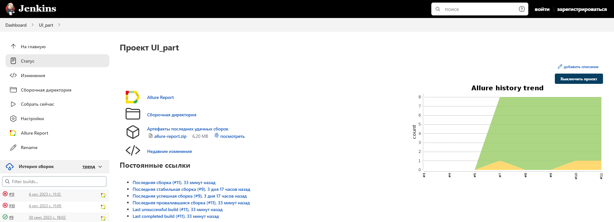
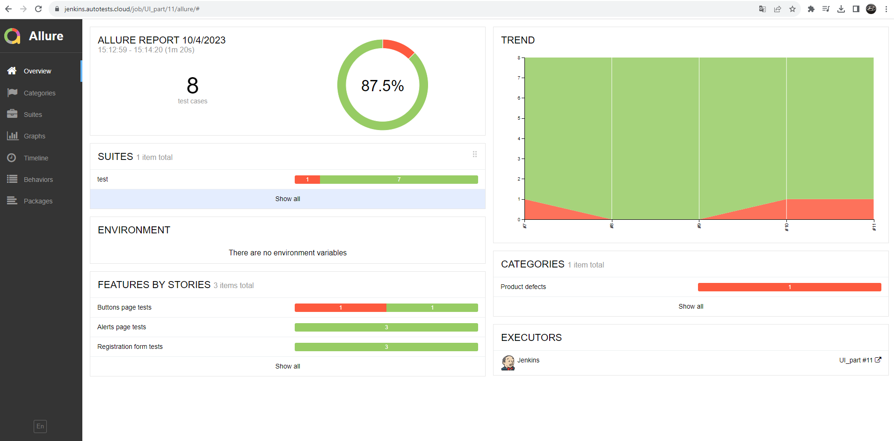
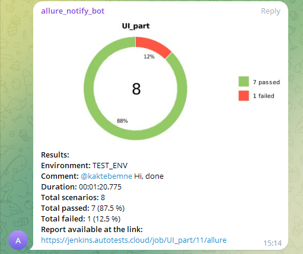

## Проект UI автотестов для демо-сайта https://demoqa.com/

### Содержит тесты на три раздела сайта:
1. #### Раздел Alerts (https://demoqa.com/alerts)
   * тесты на подтверждение алертов
   * тест на подтверждение алерта с заполнением полей в нем
2. #### Раздел Buttons (https://demoqa.com/buttons)
    * тесты с алтернативными нажатиями на элементы страницы
3. #### Раздел Practice Form (https://demoqa.com/automation-practice-form)
    * тест на регистрацию без заполнения формы
    * тест на регистрацию с заполнением всех полей формы
    * тест на регистрацию только с обязательными полями

###  [Запуск проекта в Jenkins](https://jenkins.autotests.cloud/job/UI_part/)
#### Реализована возможность выбора браузера и версии для запуска сборки

###  Отчет о прохождении тестов в [Allure report](https://jenkins.autotests.cloud/job/UI_part/11/allure/#)

### В Allure Report прикрепляются видео прохождения тестов

https://selenoid.autotests.cloud/video/f903e20497e569d2e9c3d345cfd8ca1c.mp4

###  Оповещение о прохождении тестов c кратким отчетом Telegram

